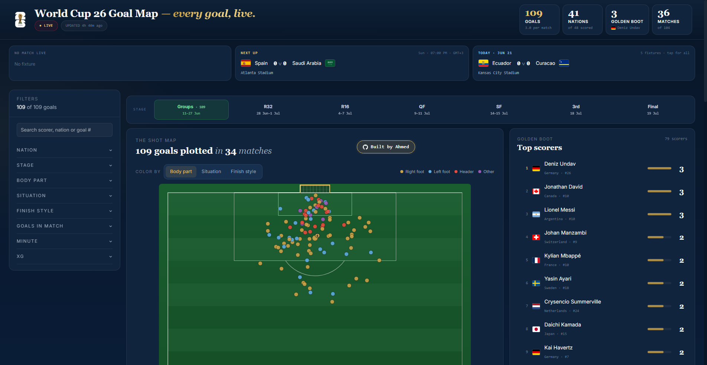

<div align="center">

# WC26 Goal Map

**Every goal of the FIFA World Cup 2026 — plotted on a pitch at the exact spot it was struck, updating live as matches are played.**

[](https://a-maherr.github.io/wc2026-goalmap/)
[](https://github.com/A-Maherr/wc2026-goalmap/actions/workflows/update-data.yml)
[](LICENSE)

### [▶ Open the live dashboard](https://a-maherr.github.io/wc2026-goalmap/)



</div>

---

> 🏁 **Tournament concluded (July 2026).** The World Cup 2026 is over, so live
> updates have stopped — the automatic refresh (`update-data.yml`) is disabled
> and the Cloudflare cron Worker that drove it has been decommissioned. The
> dashboard stays online as a static archive of the completed tournament.

Every goal is placed using **exact event-data coordinates** and projected onto an 120×80
pitch. As matches play out, new goals appear on their own; no refresh, no redeploy.

## What it does

- **Shot map of every goal** — colour by body part, situation, or finish type; hover/tap any dot for the full detail (scorer, minute, xG, distance, running score).
- **Live during matches** — goals from in-progress games land on the pitch within a couple of minutes, with the live ones spotlit so they stand out in a crowded field.
- **Deep filtering** — nation, stage, body part, situation, distance band, xG band, position, opponent, scorer, matchday — all cross-filtering, all reflected in the map and the cards.
- **Golden Boot race**, per-stage bracket view, matchday timeline, and a browsable table of every goal.

## How it works

The code lives in git; the **live data lives in object storage** — so the dashboard
updates without ever touching the repo.

```
 Cloudflare Worker (cron)        Scheduled pipeline (private)            Cloudflare R2         GitHub Pages
  ticks every 2 min        ─▶    fetch shot data → build JSON → upload ─▶  data.json  ◀─fetch─  static web/  (this repo)
  adaptive dispatch:                                                       tournament.json       renders in-browser
   • ~2 min while live                                                          ▲                 — no build step
   • ~5 min post-match                                                          │
   • 30 min idle                                                         site reads it live
```

- **Frontend (this repo)** — plain HTML + JSX: the JSX is transpiled in the browser by Babel standalone and served as static files from GitHub Pages.
- **Data delivery** — a scheduled job produces the goal data and uploads it to a Cloudflare R2 bucket; the dashboard fetches it at runtime, so fresh goals show up without a redeploy.
- **Timing** — a Cloudflare Worker cron drives the schedule, dispatching the refresh during live matches.


## Tech

`React 18` (in-browser, no bundler) · `D3` for the pitch geometry · `Tailwind` · `Framer Motion` · `GitHub Actions` · `Cloudflare Workers` + `R2` · `GitHub Pages`

## Project layout

```
web/                 the dashboard (static; served by GitHub Pages)
  index.html         entry point, theme, component load order
  app.jsx            app shell, data loading, filters, layout
  components/        pitch, sidebar, cards, drawers, hero, golden boot, …
  *.json             config + a sample snapshot of the goal data (for local dev)
  assets/            images
.github/workflows/
  pages.yml          deploy web/ to GitHub Pages on push
  update-data.yml    refresh the published goal data on demand
wrangler.toml        Cloudflare Pages config 
```

## Run it locally

```bash
python -m http.server 8080 --directory web   # → http://localhost:8080
```

On `localhost` the dashboard reads the bundled `web/data.json` sample so it works
offline out of the box; in production it reads the live data from R2.

## License & credit

MIT — see [LICENSE](LICENSE).